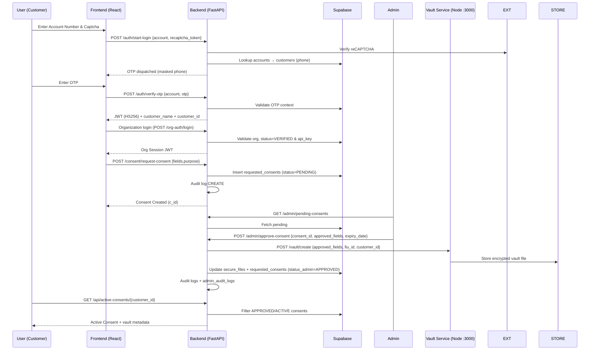
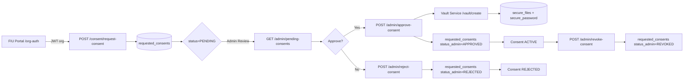
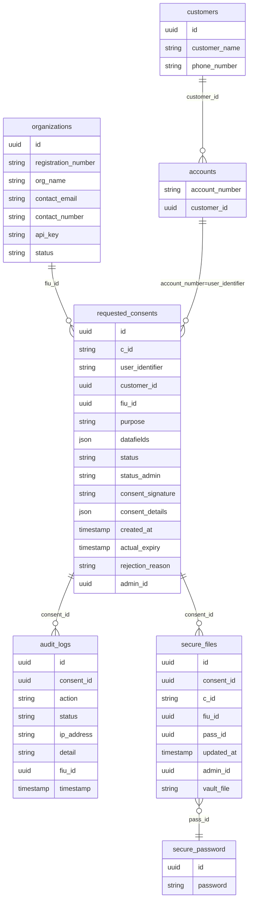
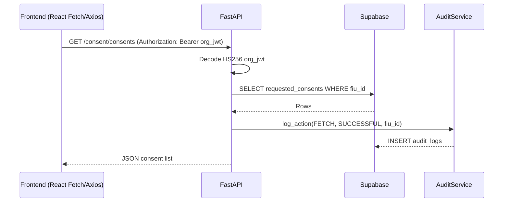

<div align="center">

# 🔐 PolicyVault Nexus

**Real-Time RBI-AA & DPDP-Compliant Zero-Persistence Data Gateway for Secure Financial Data Sharing**

[](./backend/requirements.txt)
[](https://fastapi.tiangolo.com/)
[](./frontend/package.json)
[](./Suraksha_Electron_App/new/package.json)
[](./LICENSE)
[](../../graphs/contributors)
[](../../commits/main)

</div>

---

## 📑 Table of Contents

1. [Project Overview](#1-project-overview)
2. [Architecture & Diagrams](#2-architecture--diagrams)
3. [Complete Setup Guide](#3-complete-setup-guide)
4. [API Documentation](#4-api-documentation)
5. [Usage Guide](#5-usage-guide)
6. [Security & Compliance](#6-security--compliance)
7. [Troubleshooting](#7-troubleshooting)
8. [Deployment Guide](#8-deployment-guide)
9. [Development Workflow](#9-development-workflow)
10. [Technology Stack](#10-technology-stack)
11. [License](#📄-license)
12. [Support](#📞-support--contact)

---

## 1. PROJECT OVERVIEW

PolicyVault Nexus is a zero-persistence real-time data gateway purpose-built for India's emerging Account Aggregator (AA) ecosystem and global privacy principles (DPDP Act & GDPR). It enables secure data exchange between Financial Information Users (FIUs), users, and administrative governance layers—without retaining any sensitive payloads on the server. All sensitive artifacts are transient, encrypted, or tokenized, ensuring minimized breach surface and auditability.

The platform solves the fragmentation of consent-driven financial data flows: organizations struggle with consent orchestration, multi-layer encryption, audit traceability, and regulatory alignment. PolicyVault Nexus provides a unified consent lifecycle (request → approve/reject → vault generation → controlled usage/revocation), pluggable cryptographic primitives (RSA, Fernet/AES-256, Argon2), and machine-readable audit logs. It integrates OTP-based customer login, organization verification flows, secure vault file generation, one-time password delivery, and granular field-level consent scoping.

It is designed for: fintechs integrating AA-style consent brokerage; regulated FIUs needing provable governance; compliance/security teams enforcing policy-driven access; and innovators building secure, ephemeral data-handling desktop flows (via the Electron vault manager). If you need strong cryptography, explicit consent lineage, and fast developer onboarding—this gateway is your foundation.

### Key Features & Value Propositions

- 🔐 Zero persistence: sensitive payloads never stored in plaintext
- 🧩 Modular architecture: FastAPI backend, React/Vite frontend, Electron vault service, Supabase persistence
- ✅ Consent lifecycle orchestration (request, stats, approval, rejection, revocation, expiry)
- 🔑 Multi-factor & OTP login with reCAPTCHA + Twilio SMS (fallback simulation)
- 🪪 Organization onboarding + email verification & API key issuance
- 🧪 Vault generation via external service (Node @ port 3000) + secure password handling
- 🛡️ Cryptographic stack: Argon2 password hashing, PBKDF2-derived Fernet AES-256, RSA (RS256) JWT signing
- 📜 Audit logging to `audit_logs` & admin action logs (`admin_audit_logs`)
- 🌐 CORS-permitted multi-channel UI (Frontend 5174 ↔ Backend 8000)
- 📊 Real-time consent metrics (/consent/stats)
- 🛰️ Integrations: EmailJS, Twilio, FingerprintJS, Google reCAPTCHA, GeoIP, Okta (extensible)

---

## 2. ARCHITECTURE & DIAGRAMS

### 2.1 System Architecture (Ports, Components, Protocols)

```mermaid
flowchart LR
  subgraph FE[React Frontend (Vite) :5174]
    FE_UI[Dashboards / Login / Consent UI]
  end
  subgraph BE[FastAPI Backend :8000]
    AUTH[/auth/* OTP & JWT HS256/]
    ORGA[/org-auth/* Organization Login/]
    REG[/register_org/* Verification Email & API Key/]
    CONS[/consent/* Request & Stats/]
    ADMIN[/admin/* Approval/Rejection/]
    AUD[/audit/* Logging/]
    VAULT[/admin/approve-consent -> Vault Service/]
  end
  subgraph VA[Vault Service (Node/Electron) :3000]
    VCREATE[/POST /vault/create/]
  end
  DB[(Supabase Postgres)]
  STORE[(Supabase Storage: vault, logo-org)]
  EXT1[(Twilio SMS)]
  EXT2[(EmailJS)]
  EXT3[(Google reCAPTCHA)]
  EXT4[(FingerprintJS)]
  EXT5[(GeoIP / ipinfo)]

  FE_UI -->|HTTPS JSON| AUTH
  FE_UI -->|HTTPS JSON| ORGA
  FE_UI -->|HTTPS JSON| REG
  FE_UI -->|HTTPS JSON| CONS
  FE_UI -->|HTTPS JSON| ADMIN
  AUTH --> DB
  ORGA --> DB
  REG --> DB
  CONS --> DB
  ADMIN --> DB
  ADMIN -->|Vault Metadata| STORE
  ADMIN -->|POST| VCREATE
  VCREATE --> STORE
  AUD --> DB
  AUTH --> EXT3
  AUTH --> EXT1
  REG --> EXT2
  FE_UI --> EXT4
  ADMIN --> EXT5
```

### 2.2 User Journey (Login → OTP → Consent → Encryption → Vault Generation)



### 2.3 Encryption Pipeline

```mermaid
flowchart TD
  INPUT[Raw Sensitive Field] --> TOKENIZE[(Optional FPE / FF3-1*)]
  TOKENIZE --> FERNET_ENC[AES-256 via Fernet (PBKDF2 + jwt_secret_key)]
  FERNET_ENC --> STORE_TEMP[Transient Use / Vault Packaging]
  STORE_TEMP --> RSA_SIGN[JWT RS256 Signing (admin tokens)]
  RSA_SIGN --> DELIVERY[Secure Delivery / Vault Download]
  DELIVERY --> DEST[Client-side Decryption (Authorized Party)]
  note right of TOKENIZE: *FF3-1 used in legacy vault utils (Suraksha component)
```

### 2.4 Consent Management Workflow



### 2.5 Database ER Diagram (Derived from Code Usage)



### 2.6 Component Interaction (Frontend Request Cycle)



<details>
<summary>Click to expand: Additional architectural notes</summary>

1. OTP storage is in-memory (`otp_store`) – replace with Redis in production.
2. RSA key pair generated dynamically if `private_key.pem` / `public_key.pem` absent.
3. Vault password currently handled via `secure_password` & one-time retrieval endpoint `/password-vault/{consent_id}`.
4. External EmailJS integration uses environment keys for verification emails.
5. Approval triggers Node vault service call (`http://localhost:3000/vault/create`).

</details>

---

## 3. COMPLETE SETUP GUIDE

### 3.1 Prerequisites

| Component        | Version | Source                                 |
| ---------------- | ------- | -------------------------------------- |
| Python           | 3.10+   | System                                 |
| FastAPI          | 0.116.1 | backend/requirements.txt               |
| Uvicorn          | 0.35.0  | backend/requirements.txt               |
| Node.js          | 18+     | System                                 |
| React            | 18.3.1  | frontend/package.json                  |
| Vite             | 5.4.2   | frontend/package.json                  |
| Electron         | 25.0.0  | Suraksha_Electron_App/new/package.json |
| Supabase Python  | 2.3.4   | backend/requirements.txt               |
| Redis (optional) | 6+      | External service                       |

External Services:

- Twilio SMS (OTP distribution)
- Google reCAPTCHA (bot prevention)
- EmailJS (organization verification)
- ipinfo GeoIP (admin action attribution)
- FingerprintJS (device fingerprinting)

### 3.2 Directory Layout (Verified)

```
backend/
  main.py
  auth.py
  org_auth.py
  register_org.py
  consent_requests.py
  admin_consents.py
  approved_consents.py
  consents.py
  audit_router.py
  audit_service.py
  supabase_client.py
  app/security/{crypto.py,jwt.py,token_invite.py}
frontend/
  src/pages/{admin-dashboard,user-dashboard,fiu-dashboard}
Suraksha_Electron_App/new/{main.js,generate_vault.js,renderer/}
```

### 3.3 Environment Variables (Backend `.env`)

```env
SUPABASE_URL=...
SUPABASE_SERVICE_ROLE=...
JWT_SECRET_KEY=...
JWT_PRIVATE_KEY=...            # optional if pre-provisioned
JWT_PUBLIC_KEY=...
EMAILJS_SERVICE_ID=...
EMAILJS_TEMPLATE_ID=...
EMAILJS_TEMPLATE_ID2=...       # secondary template
EMAILJS_USER_ID=...
EMAILJS_PRIVATE_KEY=...
OKTA_CLIENT_ID=...
OKTA_CLIENT_SECRET=...
OKTA_ISSUER=...
FINGERPRINTJS_API_KEY=...
REDIS_URL=redis://localhost:6379
IPINFO_TOKEN=...
RECAPTCHA_SECRET=...
TWILIO_ACCOUNT_SID=...
TWILIO_AUTH_TOKEN=...
TWILIO_PHONE_NUMBER=...
FRONTEND_BASE_URL=http://localhost:5174
JWT_SECRET_Key=...             # (note code uses this capitalization in register_org)
VERIFICATION_TOKEN_EXPIRE_HOURS=24
```

Electron `.env` (example):

```env
SUPABASE_URL=...
SUPABASE_ANON_KEY=...
VAULT_BUCKET=vault
```

### 3.4 Backend Installation

```powershell
cd backend
python -m venv venv
venv\Scripts\activate
pip install --upgrade pip
pip install -r requirements.txt
```

Run:

```powershell
uvicorn main:app --host 0.0.0.0 --port 8000 --reload
```

### 3.5 Frontend Installation

```powershell
cd frontend
npm install
npm run dev   # Serves on port 5174 (per package.json)
```

### 3.6 Electron Vault App

```powershell
cd Suraksha_Electron_App\new
npm install
npm start
```

### 3.7 Quick 5‑Minute Setup (Experienced Dev)

```powershell
git clone <repo-url>
cd PolicyVault-Nexus/PolicyVault-Nexus-Real-Time-RBI-Compliant-Data-Gateway-main
copy .env.example backend\.env   # if provided
cd backend; python -m venv venv; venv\Scripts\activate; pip install -r requirements.txt; uvicorn main:app --port 8000 --reload
start powershell -NoExit -Command "cd ../frontend; npm install; npm run dev"
start powershell -NoExit -Command "cd ../Suraksha_Electron_App/new; npm install; npm start"
```

Verification:

```powershell
curl http://localhost:8000/
curl http://localhost:8000/docs
```

<details>
<summary>Database Initialization Notes</summary>

Tables inferred: organizations, accounts, customers, requested_consents, audit_logs, secure_files, secure_password, admin_audit_logs. Ensure JSON columns (`datafields`, `consent_details`, `location_data`, `action_details`) exist with appropriate types. Add indexes: `requested_consents(fiu_id,status,status_admin)`, `audit_logs(consent_id,timestamp)`, `secure_files(consent_id)`, `organizations(api_key,status)`.

</details>

---

## 4. API DOCUMENTATION

Below is a concise but comprehensive reference based strictly on the inspected source files.

### 4.1 Authentication (Customer OTP Flow)

| Method | Path              | Description                                 | Auth | Body                                | Success Response                               |
| ------ | ----------------- | ------------------------------------------- | ---- | ----------------------------------- | ---------------------------------------------- |
| POST   | /auth/start-login | Initiate OTP login (reCAPTCHA + Twilio/SMS) | None | `{account_number, recaptcha_token}` | `{message, phoneMasked}`                       |
| POST   | /auth/verify-otp  | Verify OTP and issue JWT                    | None | `{account_number, otp}`             | `{message, token, customer_name, customer_id}` |

Example:

```bash
curl -X POST http://localhost:8000/auth/start-login ^
  -H "Content-Type: application/json" ^
  -d '{"account_number":"1234567890","recaptcha_token":"<token>"}'
```

### 4.2 Organization Registration & Verification

| Method | Path                                      | Description                            | Body                        | Notes                                   |
| ------ | ----------------------------------------- | -------------------------------------- | --------------------------- | --------------------------------------- |
| POST   | /register_org/register                    | Register organization (status=PENDING) | OrganizationCreate fields   | Returns `verification_token`, `api_key` |
| GET    | /register_org/verify-organization/{token} | Verify via emailed token               | None                        | Sets status=VERIFIED                    |
| POST   | /register_org/send-verification-email     | Trigger EmailJS send                   | `{email, org_name, org_id}` | Requires EMAILJS env vars               |
| GET    | /register_org/verify-org?token=...        | Alternate verify endpoint              | Query param                 | Similar logic                           |
| POST   | /register_org/storage/upload-logo         | Upload logo to Supabase Storage        | multipart file              | Bucket: `logo-org`                      |

### 4.3 Organization Authentication

| Method | Path              | Description                           | Body                                       | Response                        |
| ------ | ----------------- | ------------------------------------- | ------------------------------------------ | ------------------------------- |
| POST   | /org-auth/login   | Org login with email+password+api_key | `{email,password,api_key,recaptcha_token}` | JWT token (HS256) + org profile |
| POST   | /org-auth/signout | Invalidate client session             | None                                       | `{message}`                     |

### 4.4 Consent Requests (FIU Perspective)

| Method | Path                     | Description               | Auth             | Body                                                                      | Response                     |
| ------ | ------------------------ | ------------------------- | ---------------- | ------------------------------------------------------------------------- | ---------------------------- |
| POST   | /consent/request-consent | Create new consent        | Org JWT          | `{user_identifier,purpose,datafields,consent_signature?,consent_details}` | Consent record               |
| GET    | /consent/consents        | List FIU consents         | Org JWT (Bearer) | None                                                                      | Array of simplified consents |
| GET    | /consent/consents-admin  | Admin listing             | Admin context    | None                                                                      | All consents                 |
| GET    | /consent/organizations   | List organizations        | None             | `{id, org_name}`                                                          |
| GET    | /consent/stats           | Aggregate stats by status | Org JWT          | None                                                                      | `{totalRequests,...}`        |

### 4.5 User Consent Interaction (Customer Perspective)

| Method | Path                                 | Description                                | Auth             | Query/Body                    | Notes                                            |
| ------ | ------------------------------------ | ------------------------------------------ | ---------------- | ----------------------------- | ------------------------------------------------ |
| GET    | /pending?current_user_id=UUID        | Pending requests (PENDING/PENDING)         | User JWT (HS256) | Query param                   | Uses dynamic date parsing                        |
| PUT    | /{consent_id}/status                 | Update user status (APPROVED/REJECTED/...) | User JWT         | `{status, rejection_reason?}` | Sets `status` only, admin retains `status_admin` |
| GET    | /api/active-consents/{customer_id}   | Active consents                            | User JWT         | Path                          | Filters by APPROVED/APPROVED                     |
| GET    | /api/rejected-consents/{customer_id} | Rejected consents (either side)            | User JWT         | Path                          | Includes `rejection_reason`                      |

### 4.6 Admin Consent Operations

| Method | Path                                   | Description                        | Auth                        | Body                                         | Outcome                          |
| ------ | -------------------------------------- | ---------------------------------- | --------------------------- | -------------------------------------------- | -------------------------------- |
| GET    | /admin/pending-consents                | List consents needing admin action | Cookie `adminToken` (RS256) | None                                         | Pending subset                   |
| GET    | /admin/consent-details/{id}            | Detailed consent view              | Admin token                 | None                                         | Consent + account + organization |
| POST   | /admin/approve-consent                 | Approve and generate vault         | Admin token                 | `{consent_id, approved_fields, expiry_date}` | Vault file + updates             |
| POST   | /admin/reject-consent                  | Reject consent                     | Admin token                 | `{consent_id, reason}`                       | status_admin=REJECTED            |
| POST   | /admin/revoke-consent                  | Revoke active consent              | Admin token                 | `{consent_id}`                               | status_admin=REVOKED             |
| GET    | /password-vault/{consent_id}?token=... | One-time password retrieval        | Admin flow                  | Query token (future)                         | Returns password then cleanup    |
| DELETE | /api/cleanup/{consent_id}              | Cleanup password ref               | Internal                    | None                                         | pass_id nulled                   |

### 4.7 Audit & Logging

| Method | Path        | Description        | Body                                                                                        |
| ------ | ----------- | ------------------ | ------------------------------------------------------------------------------------------- |
| POST   | /audit/log  | Write audit entry  | query/form params (`consent_id`, `action`, `status`, `fiu_id`, etc.)                        |
| GET    | /audit/logs | Read filtered logs | Query params: `consent_id`, `action`, `status`, `start_date`, `end_date`, `limit`, `fiu_id` |

### 4.8 Invite Token Service (Admin Onboarding)

`token_invite.py` standalone app endpoints (if mounted):
| Method | Path | Description |
|--------|------|-------------|
| POST | /api/generate-invite-token | Generate & email admin invite token |
| GET | /api/verify-token/{token} | Verify token validity |
| POST | /api/use-token/{token} | Mark token used |
| GET | /api/health | Health probe |

<details>
<summary>Error Responses (Common Patterns)</summary>

- 400: Invalid OTP, Captcha failed, bad input format.
- 401: Missing/Invalid JWT (Bearer), incorrect API key.
- 403: Organization not verified.
- 404: Record not found (consent, organization, account).
- 429: OTP resend or attempts exceeded.
- 500: Unexpected server/database/audit or vault service failure.

</details>

---

## 5. USAGE GUIDE

### 5.1 Frontend Dashboards

| Dashboard       | Path                         | Purpose                                                 |
| --------------- | ---------------------------- | ------------------------------------------------------- |
| Landing         | `/`                          | Entry point, marketing + login initiation               |
| User Dashboard  | `/user-dashboard` or `/user` | View pending/active consents, approve/reject            |
| FIU Dashboard   | `/fiu-dashboard`             | Initiate consent requests, monitor stats                |
| Admin Dashboard | `/admin-dashboard`           | Review/approve/reject/revoke consents, audit visibility |

Workflow Examples:

1. Customer logs in via OTP → receives token → views `pending` consents → approves selected → appears in active list after admin approval.
2. FIU authenticates → submits consent with required `datafields` → monitors status shifts.
3. Admin authenticates (cookie RS256) → fetches pending consents → approves → vault generated → secure file recorded.

### 5.2 Electron Vault App

Purpose: local secure handling of vault files, optional offline decryption, and integrity checks.

Features:

- Reads Supabase storage references.
- Can support key destruction & local secure deletion.
- `generate_vault.js` coordinates packaging logic.

<!-- Screenshot: [Landing Page] -->
<!-- Screenshot: [User Pending Consents] -->
<!-- Screenshot: [Admin Approval Modal] -->
<!-- Screenshot: [Vault Download Dialog] -->

### 5.3 Step-by-Step User Consent Approval

1. FIU requests consent (PENDING/PENDING)
2. User approves (status becomes APPROVED/PENDING)
3. Admin approves (status becomes APPROVED/APPROVED → ACTIVE)
4. Admin may later revoke (status_admin=REVOKED)
5. Expiry job (future) sets EXPIRED when `actual_expiry` < now.

---

## 6. SECURITY & COMPLIANCE

### 6.1 Cryptography Implementation

| Layer                | Mechanism                   | Code Source               | Purpose                                       |
| -------------------- | --------------------------- | ------------------------- | --------------------------------------------- |
| Password Hashing     | Argon2 (passlib)            | `app/security/crypto.py`  | Admin/Org credential storage                  |
| Symmetric Encryption | Fernet (AES-256) PBKDF2HMAC | `app/security/crypto.py`  | Protect TOTP/secret material & vault contents |
| JWT User/Org         | HS256                       | `utils.py`, `org_auth.py` | Lightweight session tokens                    |
| Admin JWT            | RS256 (RSA 2048)            | `app/security/jwt.py`     | Tamper-resistant cookies                      |
| Vault Password       | bcrypt hashed               | `admin_consents.py`       | Rotate on revoke                              |

Example (Fernet encryption):

```python
encrypted, salt_hex = encrypt_data("sensitive_value")
decrypted = decrypt_data(encrypted, salt_hex)
```

### 6.2 Zero-Persistence Strategy

- OTP values ephemeral (in-memory dict, recommended Redis replacement).
- Vault files stored encrypted in Supabase Storage; passwords isolated.
- No plaintext sensitive PII persisted beyond hashed/tokenized forms.
- Dynamic RSA key generation fallback if not provisioned (consider HSM integration).

### 6.3 Compliance Mapping

| Control                   | Implementation                     | Notes                                  |
| ------------------------- | ---------------------------------- | -------------------------------------- |
| Explicit Consent          | `requested_consents` + signatures  | SHA-256 signature on `consent_details` |
| Auditability              | `/audit/log` + admin audit logs    | IP + geo enrichment                    |
| Data Minimization         | Field-level `datafields` selection | Only approved subset packaged          |
| Right to Revoke           | `/admin/revoke-consent`            | Password rotation ensures unusability  |
| Breach Detection (future) | `ml/anomaly.py` placeholder        | Extend with anomaly scoring            |

---

## 7. TROUBLESHOOTING

| Issue                    | Symptom                   | Resolution                                                                |
| ------------------------ | ------------------------- | ------------------------------------------------------------------------- |
| Backend 404 root         | `{}` or error             | Ensure running in `backend/` and command uses `main:app`                  |
| OTP always fails         | 400 Captcha failed        | Verify `RECAPTCHA_SECRET`, disable for local test by mocking response     |
| Twilio errors            | Exception printed, no SMS | Local debug prints fallback; set credentials correctly                    |
| Org login fails          | 403 not verified          | Complete email verification (`/register_org/verify-organization/{token}`) |
| Consent stats empty      | All zeros                 | Check token (Bearer) header formation `Authorization: Bearer <jwt>`       |
| Vault not generated      | Approve returns error     | Confirm Node vault service running on port 3000                           |
| RS256 admin decode fails | 401 on admin endpoints    | Regenerate `private_key.pem`/`public_key.pem` with proper permissions     |
| Datafields wrong type    | UI anomalies              | Ensure sending list OR dict; backend normalizes in `approved_consents.py` |

Common Python stack traces often reflect missing env vars; run:

```powershell
Get-Content backend\.env
```

---

## 8. DEPLOYMENT GUIDE

### 8.1 Production Steps

1. Provision managed Postgres (Supabase or RDS) & Redis.
2. Pre-generate RSA keys; mount read-only.
3. Containerize (Docker) services: backend, frontend (static build), vault service, Electron optional.
4. Use reverse proxy (Nginx / Traefik) enforcing HTTPS & security headers.
5. Centralize secrets in Vault or AWS Secrets Manager.

### 8.2 Docker (Skeleton Compose)

```yaml
version: "3.9"
services:
  api:
    build: ./backend
    env_file: backend/.env
    ports: ["8000:8000"]
  frontend:
    build: ./frontend
    ports: ["5174:80"]
  vaultsvc:
    build: ./vault-service
    ports: ["3000:3000"]
  redis:
    image: redis:7-alpine
    ports: ["6379:6379"]
```

### 8.3 Monitoring & Logging

- FastAPI access logs → structured JSON
- Audit logs already in DB; export to ELK or OpenSearch.
- Add Prometheus endpoints (`/metrics`) in future iteration.

### 8.4 Performance Tips

- Index heavy filters: consent status, fiu_id.
- Use async DB operations where possible (current supabase client is synchronous wrapper).
- Batch audit writes (queue) under load.

---

## 9. DEVELOPMENT WORKFLOW

### 9.1 Local Flow

1. Fork → create feature branch.
2. Add tests (pytest for backend, React Testing Library for frontend).
3. Run linters: `ruff` (add) & `eslint`.
4. Submit PR with diagrams updated if architecture changes.

### 9.2 Testing

Add `tests/` in backend:

```python
def test_root(client):
  r = client.get("/")
  assert r.status_code == 200
```

### 9.3 Code Standards

- Python: PEP8, type hints, avoid blocking I/O in async contexts.
- TypeScript: strict mode, descriptive types for API response.
- Security: validate all external input, sanitize file uploads.

### 9.4 Contribution Guidelines

```bash
git checkout -b feature/my-change
git commit -m "feat: add X"
git push origin feature/my-change
```

Open PR with: motivation, diagrams impacted, testing evidence.

---

## 10. TECHNOLOGY STACK

| Layer         | Technology                  | Version                 | Rationale                     |
| ------------- | --------------------------- | ----------------------- | ----------------------------- |
| API           | FastAPI                     | 0.116.1                 | High-perf async, OpenAPI docs |
| Runtime       | Python                      | 3.10+                   | Modern typing & libs          |
| Frontend      | React + Vite                | 18.3.1 / 5.4.2          | Fast DX, modular dashboards   |
| Desktop       | Electron                    | 25.0.0                  | Local secure vault ops        |
| DB            | Supabase Postgres           | Managed                 | Auth & storage integration    |
| Crypto        | cryptography/passlib/argon2 | 45.0.5 / 1.7.4 / 23.1.0 | Trusted primitives            |
| Auth          | jose + bcrypt               | 3.3.0 / 4.1.2           | JWT & password hashing        |
| Messaging     | Twilio / EmailJS            | External                | Communication & verification  |
| Observability | Audit tables                | Custom                  | Regulatory traceability       |

Integration Flow: Frontend → FastAPI → Supabase (DB/Storage) → Node Vault service → Back to FastAPI (metadata) → Client.

---

## 📄 License

This project is proprietary software developed for secure financial data operations. All rights reserved.

Important: Contains cryptographic functionality—validate export compliance for your jurisdiction.

---

## 📞 Support & Contact

- Technical Documentation: (add `/docs` directory when available)
- Security Reports: Responsible disclosure via secure channel
- Commercial Licensing: Open to enterprise engagements

Disclaimer: Provided for evaluation; production hardening (threat modeling, pen-test, key management) required.

---

## 🌟 Acknowledgments

- RBI Account Aggregator Framework
- NIST guidance
- Open source maintainers of FastAPI, Supabase, cryptography, React
- Contributors & reviewers

<p align="center">
  <em>Built with ❤️ for secure and compliant fintech operations by 
  <a href="https://github.com/thesoham2203"><b>Soham Penshanwar</b></a> & 
  <a href="https://github.com/rasikathakur"><b>Rasika Thakur</b></a>
  </em>
</p>

---

### Next Steps (Roadmap)

- Kubernetes manifests
- Docker multi-stage builds
- CI/CD (GitHub Actions) with security scans
- Anomaly detection model integration (`ml/anomaly.py`)
- Automated expiry & revocation scheduler
- Multi-tenant isolation layer

---

### Appendix: Glossary

- FIU: Financial Information User
- Consent Lifecycle: PENDING → (User APPROVED) → PENDING_ADMIN → APPROVED → ACTIVE → (REVOKED|EXPIRED|REJECTED)
- Vault File: Encrypted bundle of approved data fields, stored in Supabase Storage

---

> Generated from live repository code analysis (backend, frontend, electron components). Update if schema/routes change.
